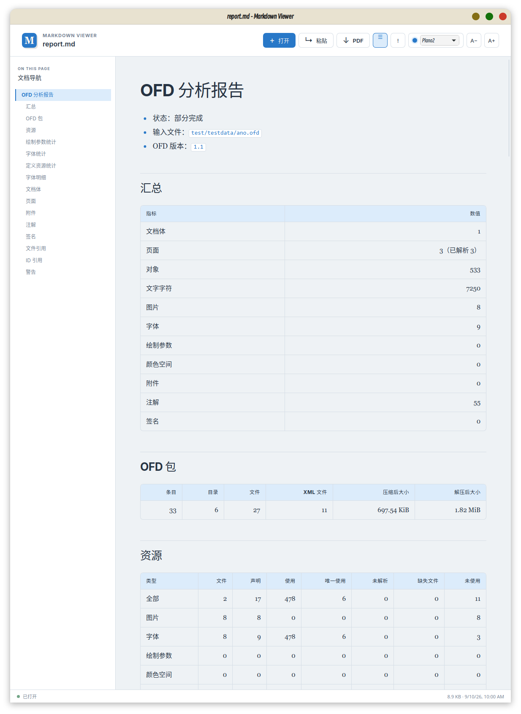

# ofd-analyzer

`ofd-analyzer` 是面向 OFD 文件的结构分析工具，用于分析文档组成、页面对象、文字、资源、附件、注解、签名和引用关系，适合文档排查、资源审计、转换问题定位以及生成结构化分析报告。默认输出纯文本报告。

## 构建

在项目根目录执行：

```bash
go build -o ofd-analyzer ./cmd/ofd-analyzer
```

也可以构建独立安装包：

```bash
make package-analyzer
```

安装包输出到 `dist/ofd-analyzer-<GOOS>-<GOARCH>.zip`。

## 用法

```text
ofd-analyzer [选项] input.ofd
```

```bash
# 默认输出纯文本
ofd-analyzer document.ofd

# 输出紧凑 JSON
ofd-analyzer --format json document.ofd

# 输出缩进后的 JSON 报告文件
ofd-analyzer --pretty -  document.ofd

# 输出纯文本、Markdown 或 PDF 报告
ofd-analyzer --format text -o report.txt document.ofd
ofd-analyzer --format markdown -o report.md document.ofd
ofd-analyzer --format pdf --font /path/to/font.ttf -o report.pdf document.ofd

# 跳过可选分析阶段
ofd-analyzer --no-annotations --no-signatures document.ofd

# 在报告中附加 OFD ZIP 包目录结构
ofd-analyzer --tree document.ofd
ofd-analyzer --tree --format json --pretty document.ofd
```

未指定 `-o` 或 `--output` 时，报告输出到标准输出。将输出路径设为 `-` 也表示输出到标准输出。
工具不会允许报告文件覆盖输入的 OFD 文件。

## 命令选项

| 选项                             | 默认值   | 说明                                                    |
|----------------------------------|----------|---------------------------------------------------------|
| `-o`, `--output PATH`            | 标准输出 | 报告输出路径，使用 `-` 输出到标准输出                   |
| `--format FORMAT`                | `text`   | 报告格式：`text`、`markdown`、`json` 或 `pdf`           |
| `--font PATH`                    | 自动     | PDF 报告使用的字体文件；仅适用于 PDF                    |
| `--signature-uid ID`             | 空       | SM2 签名用户标识；为空时使用默认 UID                    |
| `--signature-format`             | 自动     | SM2 签名值格式：`auto`、`der` 或 `raw`                  |
| `--signature-roots`              | 空       | PEM 信任根文件；指定后执行证书链校验                    |
| `--signature-crls`               | 空       | 离线 PEM/DER CRL 文件；指定后执行证书吊销校验           |
| `--signature-revocation-issuers` | 空       | 验证 CRL 签名使用的 PEM 签发者证书文件                  |
| `--pretty`                       | 关闭     | 缩进 JSON 输出                                          |
| `--no-templates`                 | 关闭     | 跳过模板定义、引用和 PageRes 资源分析，但保留模板元数据 |
| `--no-annotations`               | 关闭     | 跳过注解及 Appearance 分析                              |
| `--no-signatures`                | 关闭     | 跳过签名清单分析                                        |
| `--tree`                         | 关闭     | 输出 OFD ZIP 包目录结构                                 |
| `--fail-on-warning`              | 关闭     | 有警告时返回退出码 `1`                                  |
| `--version`                      | 关闭     | 输出 analyzer 版本                                      |
| `-h`, `--help`                   | 关闭     | 显示命令帮助                                            |

## 报告

报告包含 Schema 版本、输入信息、OFD 和 ZIP 包统计、文档体和页面列表、对象和文字统计、资源定义与使用情况、
附件、注解、签名值结构解析、签名摘要校验结果、SES 签名密码学验证结果以及文件和 ID 引用关系。签名报告包含印章 ID、名称、有效期、图片类型、
内外层签名算法 OID 和签名值编码格式，以及每个 `Reference` 的实际摘要、期望摘要、
文件存在性和匹配结果；对 SES 电子印章签名还会报告 `TBS_Sign.DataHash`、印章内部签名和外层签名校验结果。密码学验证使用签名时间检查证书有效期，
默认不加载系统根证书，因此证书信任显示为“未校验”，也不代表证书链信任或吊销状态。底层解析器可由调用方显式提供信任根执行证书链验证；使用 `--signature-crls` 和 `--signature-revocation-issuers` 可执行不联网的离线 CRL 吊销校验。工具不会访问证书中的 CRL 地址；未提供匹配 CRL 时状态为“未知”。SM2 验证支持默认 UID、调用方指定 UID，以及 DER `SEQUENCE {r,s}` 和 64 字节 `r||s` 签名值格式，三类配置可以组合使用。报告中的资源引用使用文档体作用域，例如
`doc[0]/font:3`，避免多个文档体使用相同 ID 时发生混淆。

报告始终包含 OFD ZIP 包统计；使用 `--tree` 时，报告会在文本和 Markdown 中附加 ZIP 包目录树，在 JSON 的 `package.tree` 中提供嵌套目录节点。
目录树只表示包内实际路径，不展开 XML 节点；文件引用关系仍单独输出。目录按目录优先、名称排序，文件节点包含类型和解压后大小。

## 截图



`resources` 是所有资源类别的总汇总，包含图片、字体、绘制参数、复合图元、颜色空间、模板和 Pattern；
各资源类别也通过对应的独立字段提供详细统计。字体专用字段为 `embedded`，绘制参数专用字段为
`inheritance_cycles`，不会出现在其他资源类别中。

模板、复合图元和 Pattern 默认只统计定义及引用，不展开其内部对象；因此它们的定义内容不会重复计入页面对象和文字汇总。
使用 `--no-templates` 时，模板定义、页面模板引用和模板 `PageRes` 资源均不参与分析，但文档体中的 `template_count` 和文档到模板文件的结构引用仍会保留。

绘制参数统计包括定义数、引用次数、唯一引用数、无法解析引用数和 `Relative` 继承循环数；引用次数包含
页面、模板、注解对象以及绘制参数继承产生的引用。

页面对象按 `Layer.Items` 的文档顺序递归统计。模板和注解 Appearance 的对象、文字及资源统计分别记录，不会混入普通页面对象。
字符统计同时提供 Unicode code point、UTF-8 字节、空白字符和 glyph 数量。

## 退出码

- `0`：分析完成；默认情况下存在警告仍返回 `0`。
- `1`：OFD 无法分析，或指定 `--fail-on-warning` 且报告包含警告。
- `2`：命令参数、输入文件或报告输出路径无效。
