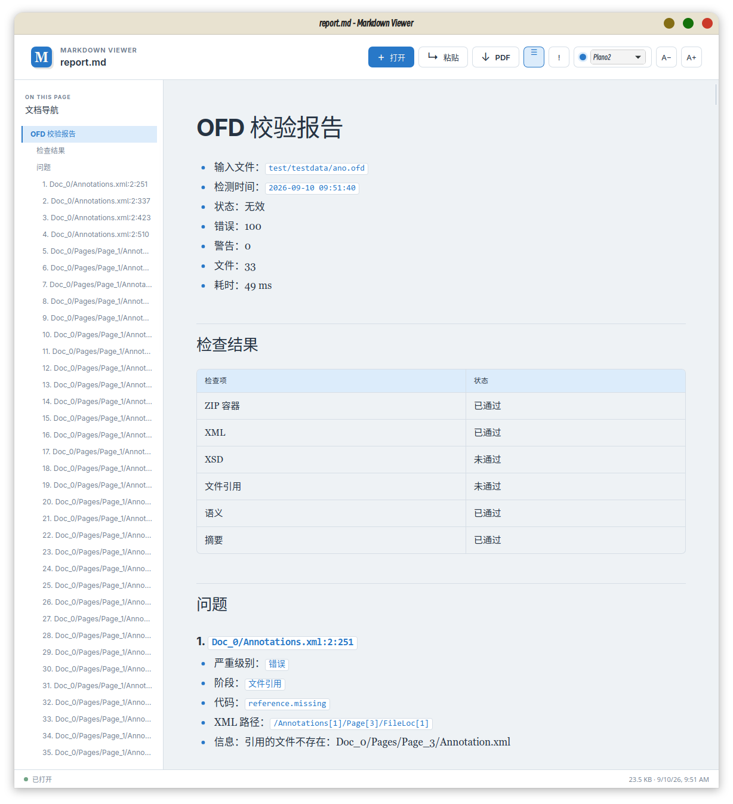
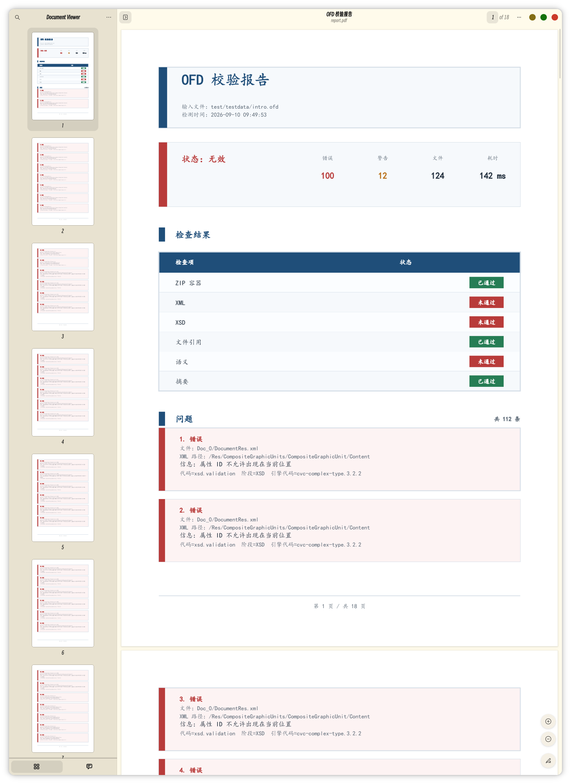

# ofd-validator

`ofd-validator` 是用于校验 OFD 文件包完整性和规范性的命令行工具，并将校验结果生成文本、Markdown、
JSON、PDF 或 XLSX 报告。它适合文档排查、兼容性检查、问题归档以及 CI 自动化校验。

使用本工具处理文档前，请阅读项目根目录的 [免责声明](../../DISCLAIMER.md)。校验通过不代表文件内容真实、完整、可信或具有法律效力。

## 功能

- 校验 ZIP 容器、路径穿越、重复条目、条目数量和解压大小限制。
- 分别限制 ZIP 原始输入大小、单个条目解压大小和整个包解压后的总大小。
- 解析 XML，并校验根元素、OFD 命名空间、节点数量和嵌套深度。
- 使用内置 XSD 校验 OFD、Document、Page、Res、Signature 等 XML 文件。
- 校验 OFD 包内的文档、页面、资源、附件、注解和签名文件引用。
- 校验 OFD 对象 ID 的重复声明和未解析引用。
- 校验签名摘要，支持 MD5、SHA1、SM3 和 SM3 OID `1.2.156.10197.1.401`。
- 可扫描未被主引用链直接引用的 OFD 命名空间 XML；外部命名空间 XML 内容不会参与 OFD
  引用和语义检查。
- 输出中文文本、Markdown、JSON、PDF 和 XLSX 报告。
- PDF 报告每页底部显示页码，例如 `第 1 页 / 共 3 页`。

报告包含输入文件、检测时间、校验状态、错误和警告汇总、各校验阶段状态，以及每条问题的严重级别、
校验阶段、错误代码、文件位置和 XML 路径等详细信息。JSON 报告保留机器可读字段，并提供对应的中文
标签，适合 CI 和脚本处理；Markdown 和 PDF 报告适合归档和阅读。

## 截图

### Markdown 报告



### PDF 报告



## 构建

在项目根目录执行：

```bash
go build -o ofd-validator ./cmd/ofd-validator
```

也可以使用 Makefile 构建 Linux 当前平台的校验器安装包：

```bash
make package-validator
```

安装包输出到 `dist/ofd-validator-<GOOS>-<GOARCH>.zip`，其中包含校验器二进制文件和本说明文档。

## 快速开始

命令格式：

```text
ofd-validator [选项] input.ofd
```

```bash
# 默认以 strict 模式输出中文文本
ofd-validator --format text document.ofd

# 输出缩进后的 JSON 报告
ofd-validator --format json --pretty document.ofd > report.json

# 输出 Markdown 报告文件
ofd-validator --format markdown -o report.md document.ofd

# 根据输出文件扩展名自动选择报告格式
ofd-validator -o report.md document.ofd
ofd-validator -o report.json document.ofd
ofd-validator -o report.txt document.ofd

# 输出 PDF 报告；字体必须支持中文
ofd-validator --format pdf --font /path/to/cjk-font.ttf -o report.pdf document.ofd

# 输出 XLSX 报告
ofd-validator --format xlsx -o report.xlsx document.ofd
ofd-validator -o report.xlsx document.ofd
```

未指定 `-o` 或 `--output` 时，报告输出到标准输出。将输出路径设为 `-` 也表示输出到标准输出。
工具不会允许报告文件覆盖输入的 OFD 文件。

## 校验模式

- `strict`：执行 ZIP、XML、内置 XSD、文件引用、语义 ID 和摘要校验。XSD 错误会使报告失败。
- `compat`：执行相同校验，但将 XSD 错误降级为警告；ZIP、XML、引用、语义和摘要错误仍然会失败。
- `structural`：执行 ZIP、XML、文件引用和语义检查，不执行 XSD 校验。没有错误时报告状态通常为
  `partial`（部分通过），因为 XSD 阶段被跳过。

`--skip-xsd` 会跳过 XSD 阶段；在默认的 `strict` 模式下等价于使用 `structural` 模式。

## 命令选项

| 选项                                 | 默认值      | 说明                                                   |
|--------------------------------------|-------------|--------------------------------------------------------|
| `--format text\|markdown\|json\|pdf\|xlsx` | `text` | 报告格式；未显式指定时可根据输出扩展名自动推断         |
| `--mode strict\|compat\|structural`  | `strict`    | 校验模式                                               |
| `-o`, `--output PATH`                | 标准输出    | 报告输出路径，使用 `-` 输出到标准输出                  |
| `--font PATH`                        | 自动查找    | PDF 使用的中文字体文件；只能与 `--format pdf` 一起使用 |
| `--pretty`                           | 关闭        | 缩进 JSON 输出                                         |
| `--skip-xsd`                         | 关闭        | 跳过 XSD 校验                                          |
| `--no-digest`                        | 关闭        | 跳过签名摘要校验                                       |
| `--no-scan-xml`                      | 关闭        | 只解析由 OFD 引用到的 XML 文件                         |
| `--doc-type OFD\|OFD-A\|OFD-H`      | 自动        | 额外校验的 OFD profile；留空时按文档声明的 `DocType` 自动判定 |
| `--fail-on-warning`                  | 关闭        | 有警告时也返回退出码 `1`                               |
| `--max-errors N`                     | `100`       | 最多记录的校验错误数量；`0` 表示不限制                 |
| `--max-input-size BYTES`             | `536870912` | ZIP 原始输入数据的最大字节数，即 512 MiB               |
| `--max-file-size BYTES`              | `67108864`  | 单个 ZIP 条目解压后的最大字节数，即 64 MiB             |
| `--max-total-size BYTES`             | `536870912` | OFD 包解压后的最大总字节数，即 512 MiB                 |
| `--max-entries N`                    | `10000`     | ZIP 条目的最大数量                                     |
| `--max-xml-bytes BYTES`              | `67108864`  | 单个 XML 文件的最大字节数，即 64 MiB                   |
| `--max-xml-nodes N`                  | `2000000`   | 单个 XML 文件的最大节点数量                            |
| `--max-xml-depth N`                  | `1000`      | 单个 XML 文件的最大嵌套深度                            |
| `--version`                          | 关闭        | 输出工具版本                                           |
| `-h`, `--help`                       | 关闭        | 显示命令帮助                                           |

大小参数使用字节数，不支持 `64M`、`512M` 等单位后缀。限制参数不能为负数。

## OFD profile 校验

文件在 `OFD.xml` 根节点声明的 `DocType` 决定了按哪套规则校验。本文把这样一套规则称为一个
profile，它由 `DocType` 取值决定：

```text
OFD     基础版式文档（GB/T 33190—2016），不做 profile 校验
OFD-A   档案长期保存（GB/T 42133—2022《信息技术 OFD档案应用指南》）
OFD-H   电子病历版式文档（GB/T 48666-2026《电子病历版式文档技术要求》，征求意见稿）
```

声明 `OFD-A` 即表示该文件承诺满足 GB/T 42133，校验器会自动应用对应规则，不需要额外参数。`OFD-H` 以 `OFD-A` 为基础，因为电子病历标准声明其数据内容与组织应符合 GB/T 42133；在此之上它既可以收窄继承来的规则，也可以新增自己的规则。

用 `--doc-type` 可以在不改写文件 `DocType` 的前提下预检，例如检查一份基础 OFD 是否已满足长期保存要求：

```bash
ofd-validator --doc-type OFD-A --mode strict input.ofd
```

报告的 `profile` 字段给出本次实际应用的 profile——它是「按哪套规则校验的」，未必等于文件声明的值：用 `--doc-type OFD-A` 预检基础 OFD 时该字段为 `OFD-A`，文件本身仍声明 `OFD`。JSON 输出中的 `checks` 会包含名为 `profile` 的检查项。当前实现的规则：

| 问题码                                       | 依据                    | 内容                             |
|----------------------------------------------|-------------------------|----------------------------------|
| `profile.<p>.single_document`                 | GB/T 42133 6.2.1 c)     | 归档文件不使用多文档机制         |
| `profile.<p>.encrypted`                       | GB/T 42133 6.16         | 长期保存文件不含加密选项         |
| `profile.<p>.permissions_present`             | GB/T 42133 6.2.2 a)     | `Document.xml` 不含权限声明      |
| `profile.<p>.vpreferences_present`            | GB/T 42133 6.2.2 b)     | `Document.xml` 不含视图首选项    |
| `profile.<p>.extensions_present`              | GB/T 42133 6.2.2 e)     | `Document.xml` 不含扩展信息      |
| `profile.<p>.document_action_not_goto`        | GB/T 42133 6.2.2 c)     | 文档动作仅保留文档内跳转         |
| `profile.<p>.page_action_not_goto`            | GB/T 42133 6.2.3 c)     | 页面动作仅保留文档内跳转         |
| `profile.<p>.outline_action_not_goto`         | GB/T 42133 6.2.5 a)     | 大纲节点动作仅保留文档内跳转     |
| `profile.<p>.image_format`                    | 见下表                  | 栅格图像格式在允许清单内         |
| `profile.<p>.colorspace_type`                 | GB/T 42133 6.3.1 b)     | 颜色空间限灰度、RGB、CMYK        |
| `profile.<p>.pageblock_depth`                 | GB/T 42133 6.2.3 e)     | 页面块嵌套不超过 3 层            |
| `profile.ofd_h.signature_coverage`            | GB/T 48666 8 c)         | 签名保护范围覆盖除列表外的内容   |

`<p>` 是 `DocType` 取值的小写下划线形式（`ofd_a`、`ofd_h`）。

`image_format` 的允许清单按 `DocType` 不同：OFD-H 若沿用 GB/T 42133 的六种，判定会比
GB/T 48666 宽松（后者只允许四种），因此 OFD-H 以同名规则覆盖为四项：

| `DocType` | 依据                | 允许格式                              |
|-----------|---------------------|---------------------------------------|
| `OFD-A`   | GB/T 42133 6.2.6 e) | BMP、JPEG、PNG、JBIG2、JPEG2000、TIFF |
| `OFD-H`   | GB/T 48666 7.2 d)   | BMP、JPEG、TIFF、PNG                  |

`signature_coverage` 只在 OFD-H 下执行，且仅在包内存在签名列表时检查；未覆盖的
文件记为警告而非错误。

GB/T 42133 中「去除×××」一类条款本质是转换动作而非合规条件，校验器只判定并上报「有 ×× 但 profile 不允许」，不修改文档；字型子集化、图像插值、扫描件分层等需要阈值或启发式判断的条款暂未实现。`OFD-H` 已实现 GB/T 48666 的图像格式与签名覆盖两条规则，其余条款（字体全嵌入、元数据与保密等级、附件与版本）因需要额外字段约定或阈值判断暂未实现；该标准目前为征求意见稿，条款可能变化。

## 报告格式

- `text`：适合终端查看的中文纯文本报告。
- `markdown`：包含检查结果和逐条问题详情的 Markdown 报告。
- `json`：保留英文机器字段和枚举值，同时提供 `status_zh`、`severity_zh`、`stage_zh` 等中文字段；
  适合 CI、脚本和其他程序处理。
- `pdf`：A4 可搜索文本报告。需要能够显示中文的字体；可使用 `--font` 显式指定字体。每一页底部
  会显示当前页码和总页数。
- `xlsx`：Excel 工作簿报告，包含「汇总」页和「问题」页。汇总页展示校验状态、错误/警告/提示统计和
  各检查阶段结果；问题页逐条列出问题详情，并带有自动筛选和冻结表头，适合在 Excel 中筛选、归档和
  二次处理。

PDF 示例：

```bash
ofd-validator --format pdf \
  --font /path/to/SimSun.ttf \
  --output validation-report.pdf \
  document.ofd
```

未指定 `--font` 时，工具会先查找常见中文系统字体，再扫描系统字体目录。如果环境中没有可用中文字体，
PDF 输出会失败；文本、Markdown 和 JSON 报告不受此限制。

未显式指定 `--format` 时，输出文件扩展名 `.txt`、`.md`/`.markdown`、`.json`、`.pdf` 和 `.xlsx`
分别对应 `text`、`markdown`、`json`、`pdf` 和 `xlsx`；显式指定的格式优先。标准输出、无扩展名或
其他扩展名仍默认使用 `text`。

## 退出码

- `0`：校验没有错误；默认情况下存在警告仍返回 `0`。
- `1`：存在校验错误，或指定 `--fail-on-warning` 且存在警告。
- `2`：命令参数、输入文件、报告输出路径、字体或其他工具配置无效。

## CI 示例

严格校验并保存机器可读报告：

```bash
ofd-validator --format json --pretty \
  --output validation-report.json \
  document.ofd
status=$?
test "$status" -eq 0
```

对历史文件使用兼容模式，但仍要求不能有任何警告：

```bash
ofd-validator --mode compat --fail-on-warning document.ofd
```

只做结构检查，跳过可能不兼容的 XSD 校验：

```bash
ofd-validator --mode structural document.ofd
```
