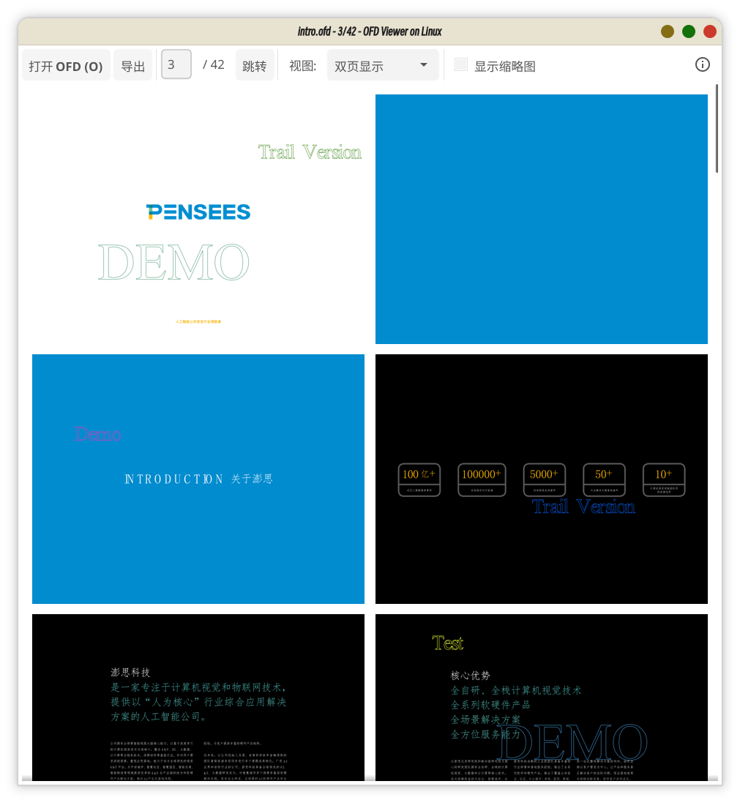
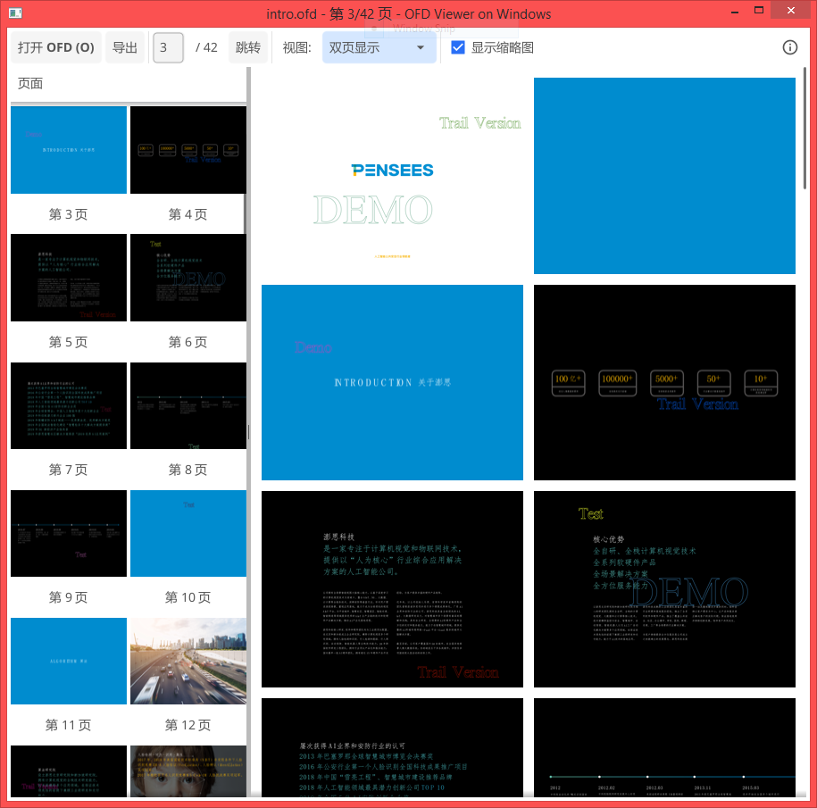
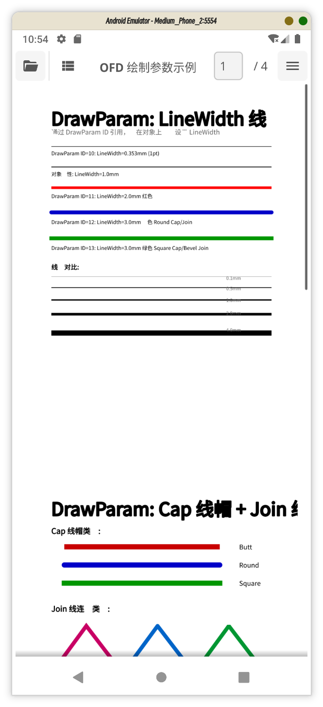

# OFD Viewer

OFD 桌面查看器，支持连续阅读和按需渲染。版本号由根目录 `Makefile` 的 `VERSION` 决定，运行中的版本见「关于」对话框。

使用本工具打开不可信或敏感文档前，请阅读项目根目录的 [免责声明](../../DISCLAIMER.md)。阅读器不替代生产环境的文件安全、权限控制和隐私保护措施。

## 功能

- 鼠标滚轮连续翻页，页码自动同步
- 页码输入跳转，支持 `Home`、`End` 和方向键翻页
- 缩略图默认隐藏，可按需显示并点击跳转
- 支持“适应页面”“适应宽度”“适应高度”和“双页显示”四种视图
- 启动窗口宽度固定 700，高度按“首屏放得下整页 A4”算出（另加工具栏高度和页面边距），默认“适应宽度”下一屏正好一整页，不用拉滚动条
- 双页视图按两列连续排列页面
- 双页视图下缩略图也按两列显示
- 阅读区背景色支持白色、透明、7 种预设色和自定义取色，预设与浏览器阅读器保持一致，选择会被记住
- 多文档体按出现顺序连续阅读，页码使用全局页码
- 页面和缩略图均按需加载，可见页两侧各预取一页，滚动换页不易出现白屏
- 阅读区使用布局虚拟化：显示帧数量只与视口有关，上万页文档也只常驻十余个页面对象
- 页面图像和缩略图按内存预算限流，超出后淘汰没有显示帧引用的页面，滚动过长文档不会耗尽内存
- 导出支持 PDF、TXT、JPG、PNG、SVG、EPS、TeX
- 多页图片/矢量格式导出为 ZIP，单页直接保存对应文件
- 导出支持 DPI 和透明/白色背景设置；DPI 上限按页面尺寸和单页内存预算收紧
- 支持 Android 文件选择、文档查看和 APK 打包
- Android 返回键连续按两次后确认退出程序
- 信息按钮查看应用信息和 GitHub 项目地址
- Linux 启动时检查自己是不是 `.ofd` 的默认阅读器，不是就询问是否设置，可勾选“不再提示”并被记住
- 右侧菜单提供“设为默认阅读器”，已是默认阅读器时打勾；不支持的系统不显示该项

## 阅读背景色

右侧菜单的“背景色”提供白色、透明、7 种预设色（暗夜紫灰、晨雾暖沙、复古深棕、极光钢蓝、柔光羊皮、半岛墨蓝、晴空浅灰）和“自定义…”。每项左侧有色卡，能直接看出颜色；“自定义”打开取色器，可以选任意颜色（含透明度）。预设与 WASM 阅读器的“文档背景色”是同一套，两边不会漂移；选择记在应用偏好里，下次启动沿用。

背景色只改页面纸张矩形的填充色：页面本身按透明背景渲染，未上色区域（例如径向渐变 Extend=0 时起始圆以内的区域）因此显示所选颜色而不是白色。切换立即生效，不需要重新渲染页面，加载和导出期间也可以切换。

## 默认阅读器

只有 Linux（不含 Flatpak）支持自动检测和设置文件关联：

- 检测顺序是 `xdg-mime`、`gio`，最后直接读 `$XDG_CONFIG_HOME/mimeapps.list`（只取 `[Default Applications]` 段）。探测不出结果时不弹提示，菜单项也不打勾——缺命令的精简系统上弹了也只能失败。
- 设置通过 `xdg-mime default` 或 `gio mime --default` 完成，由命令保留 `mimeapps.list` 里已有的分组和格式；命令失败会把命令输出带进错误信息。
- 启动时带文件参数运行（`ofd-viewer doc.ofd`）不提示：命令行用法是明确的意图。
- “不再提示”记在应用偏好里（`default-reader-prompt-dismissed`），成功设置默认阅读器后也会自动记住。删除偏好才能恢复提示。
- macOS、Windows、Android 和 Flatpak 的文件关联由各自的系统设置或安装流程管理，右侧菜单不显示“设为默认阅读器”。

## 使用

启动后点击“打开 OFD”，或通过命令行打开文件：

```bash
go run . path/to/document.ofd
```

Android 版本可通过系统文件选择器打开 OFD 文件。右侧菜单中的“关闭文档”用于返回未加载状态；未加载文档时选择“退出程序”，或连续按两次 Android 返回键并确认，即可退出应用。

快捷键：

- `O`：打开 OFD
- `A` / `W` / 左箭头 / 上箭头：上一页
- `D` / `S` / 右箭头 / 下箭头：下一页
- `PageUp` / `PageDown`：按一屏翻页，并吸附到页边界
- `Home` / `End`：跳到第一页或最后一页
- `Q` / `Esc`：逐层退出——已加载文档时先关闭文档，未加载文档时退出程序（与菜单和 Android 返回键一致）

## 编译

```bash
go build .
```

Linux 构建需要 OpenGL 和 X11 开发库。

## 多平台编译

以下命令在当前目录执行，编译结果保存到 `dist` 目录：

```bash
mkdir -p dist

# Linux x86_64
GOOS=linux GOARCH=amd64 CGO_ENABLED=1 \
  go build -o dist/ofd-viewer-linux-amd64 .

# Linux ARM64
GOOS=linux GOARCH=arm64 CGO_ENABLED=1 \
  go build -o dist/ofd-viewer-linux-arm64 .

# Windows x86_64，需要安装 MinGW-w64
CC=x86_64-w64-mingw32-gcc GOOS=windows GOARCH=amd64 CGO_ENABLED=1 \
  go build -ldflags "-H=windowsgui" -o dist/ofd-viewer-windows-amd64.exe .

# macOS Apple Silicon，需要在 macOS 环境中执行
GOOS=darwin GOARCH=arm64 CGO_ENABLED=1 \
  go build -o dist/ofd-viewer-darwin-arm64 .

# macOS Intel，需要在 macOS 环境中执行
GOOS=darwin GOARCH=amd64 CGO_ENABLED=1 \
  go build -o dist/ofd-viewer-darwin-amd64 .
```

Fyne 桌面程序依赖 CGO 和目标平台的图形开发库。Linux 目标需要 OpenGL/X11 开发库，Windows 目标需要 MinGW-w64；macOS 目标通常应在 macOS 环境中编译。

Windows 版本使用 `-H=windowsgui` 编译，不显示命令行窗口。

Android APK 需要安装 Fyne 命令行工具、Android SDK 和 NDK：

```bash
make package-viewer-android
```

如果只需要 Android 压缩包，可执行：

```bash
make package-viewer-android-zip
```

## 截图




