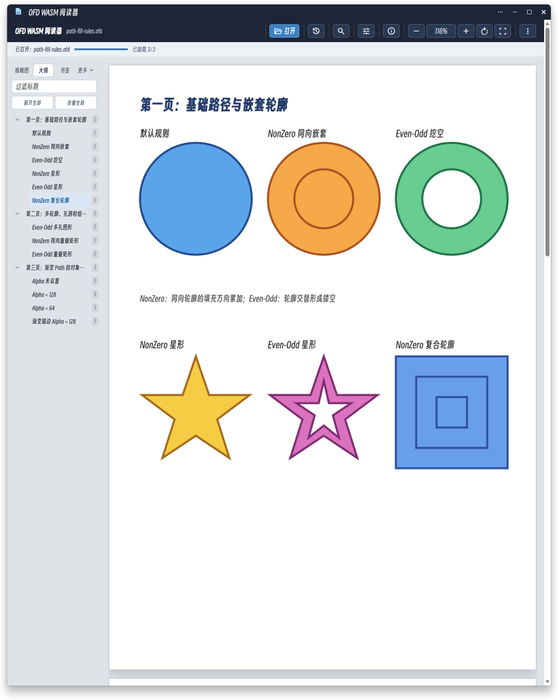
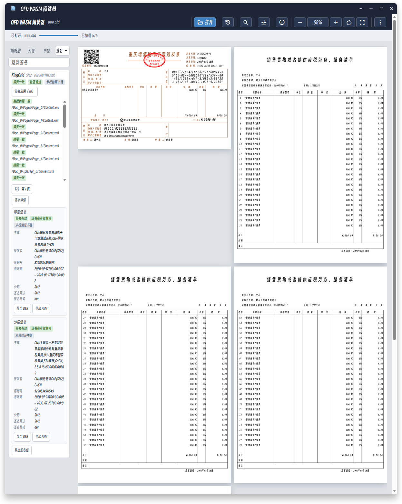
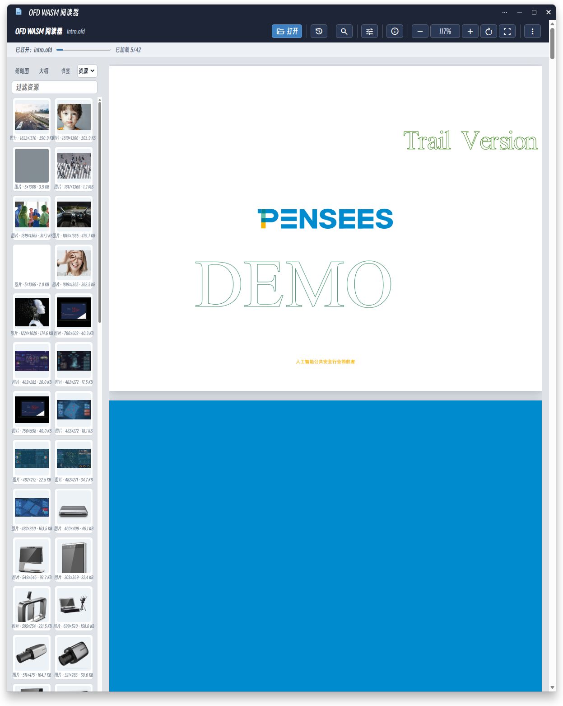

# OFD WASM

OFD WASM 将 OFD 文档解析和渲染能力提供给浏览器 JavaScript 使用。

使用阅读器处理不可信或敏感文档前，请阅读项目根目录的 [免责声明](../../DISCLAIMER.md)。在线示例不替代生产环境的文件安全、权限控制和隐私保护措施。

浏览器阅读器示例和可直接部署的 Web 页面位于 [`web`](web) 目录。

## 截图






## 快速开始

在仓库根目录执行：

```bash
make build-wasm
python3 -m http.server 8080 --directory cmd/ofd-wasm/web
```

然后打开 <http://localhost:8080>，选择一个 `.ofd` 文件即可开始阅读。

浏览器不能通过 `file://` 直接加载 WASM。完整的功能、API、构建、部署和协议说明见 [`web/README.md`](web/README.md)。
